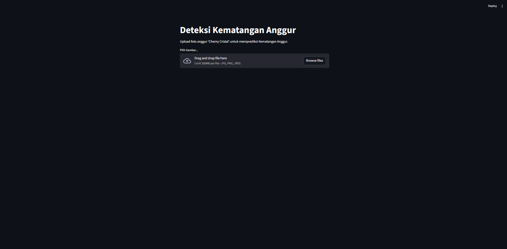
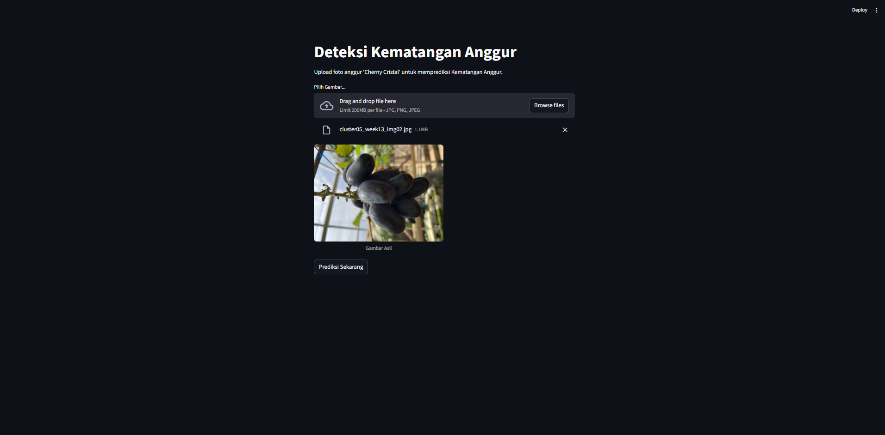
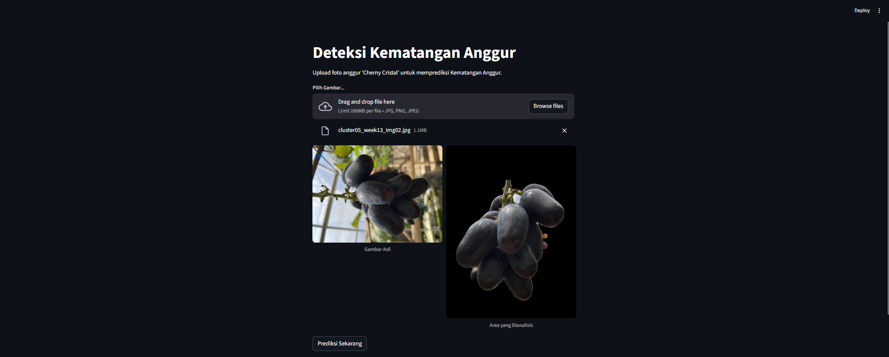

# Prediksi Kematangan Anggur Jenis Cherny Cristal

## Cara Install & Run

1. **Clone repo:**
https://github.com/winnieee14/Prediksi-Kematangan-Anggur.git

2. **Buka di Visual Studio**  
Buka File app.py pada Visual Studio Code

3. **Install Library**  
Buka Terminal dan jalankan command pip install streamlit ultralytics opencv-python pandas joblib matplotlib xgboost

4. **Jalankan program**  
Buka Terminal dan jalankan command streamlit run app.py

## Contoh Tampilan & Contoh penggunaan

### Tampilan awal

### Pilih Gambar Anggur Cherny Criystal

### Click Prediksi Sekarang Untuk dapat menampilkan hasil Prediksi sisa hari anggur Cherny Cristal akan matang
Model akan menunjukkan hasil gambar setelah dilakukan segmentasi guna untuk memanggkan latar belakang dan hanya mengambil anggur

Lalu Model Regresi akan menunjukkan hasil prediksi berapa lama waktu lagi yang diperlukan untuk anggur dapat matang berserta dengan Analisis Histogram Warna

 
